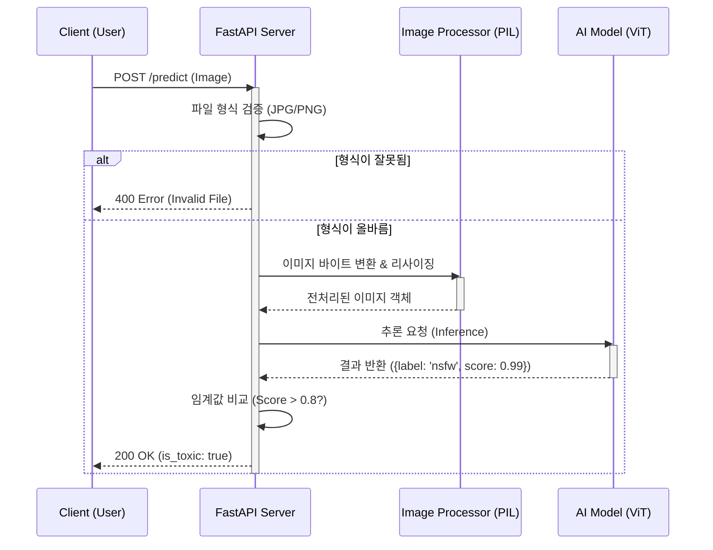

# Image_filter
## 설명
이미지의 선정성, 폭력성, 혐오성 컨텐츠가 존재하는지 필터링하는 api입니다.

## 사용방법
```bash
git clone https://github.com/Focuslice/image_filter.git
# git 서브모듈까지 업데이트
git submodule update --init --recursive

docker build -t {image 이름} .
docker run -d -p 8000:8000 --name {컨테이너 이름} {이미지 이름}
```

## 아키텍처
