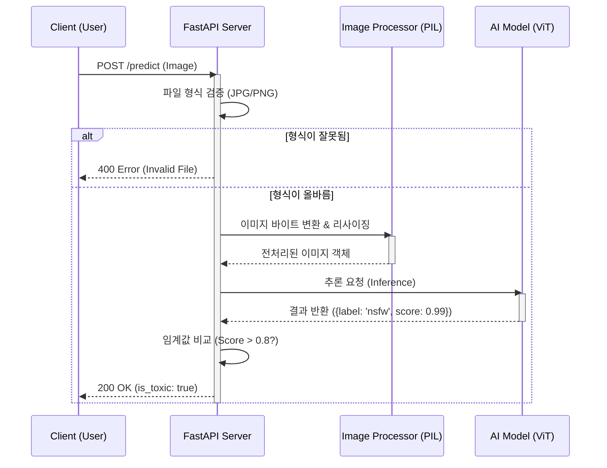

```mermaid
graph TD
    subgraph Host["Host Machine"]
        Client[Client / Request]
        
        subgraph Docker["Container (nsfw-filter-app)"]
            FastAPI[FastAPI App]
            Uvicorn[Uvicorn Server]
            Logic[Inference Logic]
        end
        
        Volume[("Docker Volume<br/>(Model Cache)")]
    end

    Client -->|HTTP POST| Uvicorn
    Uvicorn --> FastAPI
    FastAPI --> Logic
    Logic <-->|Load Model| Volume
    ```